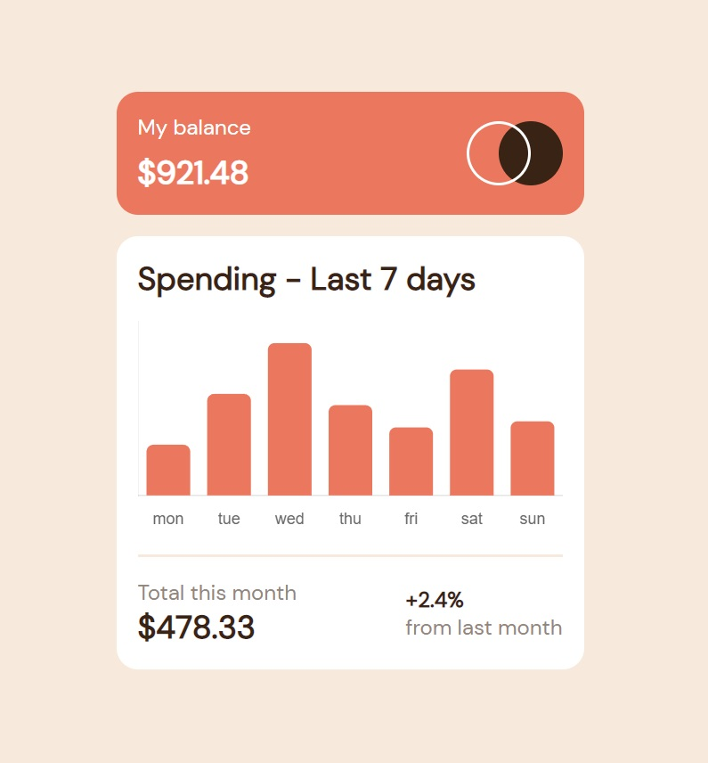

# expensesCalculator

## Overview

### The challenge

Users should be able to:

- View the bar chart and hover over the individual bars to see the correct amounts for each day
- See the current day’s bar highlighted in a different colour to the other bars
- View the optimal layout for the content depending on their device’s screen size
- See hover states for all interactive elements on the page
- **Bonus**: Use the JSON data file provided to dynamically size the bars on the chart

### Screenshot

## My process

### Built with

- Semantic HTML5 markup
- CSS custom properties
- Flexbox
- CSS Grid
- [Chart.js](https://www.chartjs.org/) - JS library
- [Styled Components](https://styled-components.com/) - For styles
 choices**

### Useful resources

- [Chart.js](https://www.chartjs.org/) - This helped me to understand the concept of injecting charts into your JavaScript. I really liked this pattern and will use it going forward.

## Author

- Website - [Hizami Ramat](https://github.com/HizamiRamat)
